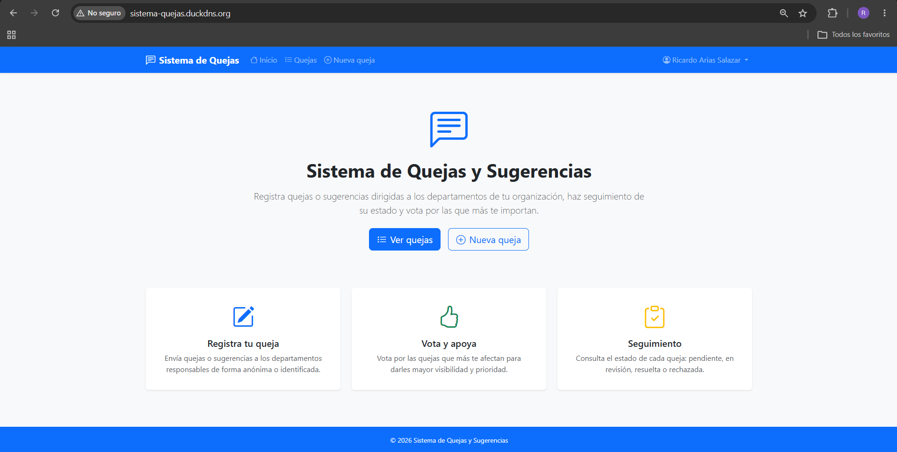
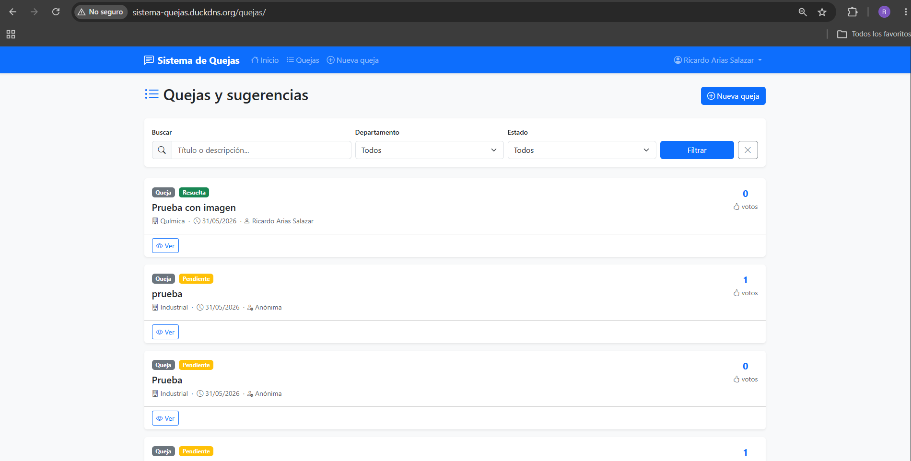
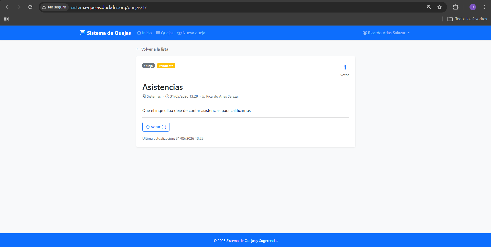
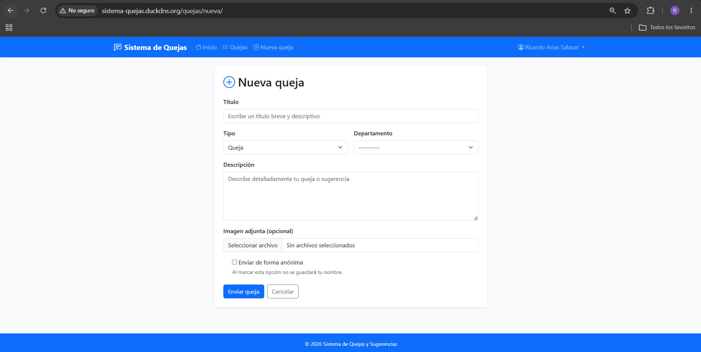
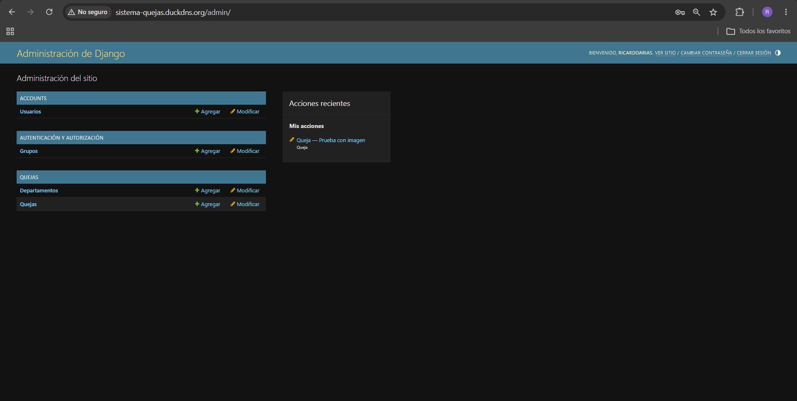

# Sistema de Quejas y Sugerencias

Aplicación web desarrollada con Django que permite a los estudiantes registrar quejas o sugerencias dirigidas a los departamentos de su institución, votar por ellas y hacer seguimiento de su estado.

## Capturas de pantalla

> Las imágenes están en la carpeta [`docs/capturas/`](docs/capturas/).

### Página de inicio


### Lista de quejas


### Detalle de queja


### Formulario de nueva queja


### Panel de administración


---

## Tecnologías utilizadas

| Tecnología | Versión | Uso |
|---|---|---|
| Python | 3.12 | Lenguaje base |
| Django | 5.0.6 | Framework web |
| PostgreSQL | 15 | Base de datos |
| Bootstrap | 5.3 | Interfaz de usuario |
| Gunicorn | 26 | Servidor WSGI |
| Nginx | Alpine | Proxy inverso y archivos estáticos |
| Docker + Compose | 29+ | Contenedorización |
| Whitenoise | 6 | Archivos estáticos en desarrollo |

---

## Requisitos previos

- [Docker Desktop](https://www.docker.com/products/docker-desktop/) instalado y activo
- [Git](https://git-scm.com/) instalado
- Puerto **80** y **5433** disponibles en la máquina

---

## Ejecutar en local con Docker

### 1. Clonar el repositorio

```bash
git clone <URL-del-repositorio>
cd sistemaDeQuejas
```

### 2. Crear el archivo de entorno

```bash
cp .env.example .env
```

Edita `.env` con tus valores (ver tabla de variables más abajo). Para desarrollo local puedes usar los valores de ejemplo.

### 3. Levantar los contenedores

```bash
docker-compose up -d --build
```

### 4. Crear el superusuario

```bash
docker-compose exec web python manage.py createsuperuser
```

### 5. Cargar datos iniciales (departamentos)

```bash
docker-compose exec web python manage.py loaddata quejas/fixtures/datos_iniciales.json
```

### 6. Abrir el navegador

- Aplicación: [http://localhost](http://localhost)
- Panel de administración: [http://localhost/admin](http://localhost/admin)

### Comandos útiles

```bash
# Ver logs en tiempo real
docker-compose logs -f web

# Estado de los contenedores
docker-compose ps

# Ejecutar tests
docker-compose exec web python manage.py test quejas accounts

# Detener todo
docker-compose down
```

---

## Despliegue en IONOS VPS (Ubuntu 22.04)

### 1. Conectar al VPS por SSH

```bash
ssh root@<IP-DEL-VPS>
```

### 2. Instalar Docker y Docker Compose

```bash
apt update && apt upgrade -y

apt install -y ca-certificates curl gnupg
install -m 0755 -d /etc/apt/keyrings
curl -fsSL https://download.docker.com/linux/ubuntu/gpg | gpg --dearmor -o /etc/apt/keyrings/docker.gpg
chmod a+r /etc/apt/keyrings/docker.gpg

echo "deb [arch=$(dpkg --print-architecture) signed-by=/etc/apt/keyrings/docker.gpg] \
https://download.docker.com/linux/ubuntu $(. /etc/os-release && echo "$VERSION_CODENAME") stable" \
| tee /etc/apt/sources.list.d/docker.list > /dev/null

apt update
apt install -y docker-ce docker-ce-cli containerd.io docker-compose-plugin
```

### 3. Clonar el repositorio en el servidor

```bash
git clone <URL-del-repositorio> /opt/sistemaDeQuejas
cd /opt/sistemaDeQuejas
```

### 4. Crear el archivo `.env` de producción

```bash
cp .env.example .env
nano .env
```

Ajusta los valores para producción (ver tabla de variables). Asegúrate de:

- `DEBUG=False`
- `SECRET_KEY` con un valor largo y aleatorio
- `ALLOWED_HOSTS` con la IP pública del VPS
- `DB_PASSWORD` con una contraseña segura

### 5. Levantar los servicios

```bash
docker compose up -d --build
```

### 6. Crear superusuario y cargar datos iniciales

```bash
docker compose exec web python manage.py createsuperuser
docker compose exec web python manage.py loaddata quejas/fixtures/datos_iniciales.json
```

### 7. Verificar el despliegue

```bash
# Estado de los contenedores
docker compose ps

# Logs del servicio web
docker compose logs web

# Logs de nginx
docker compose logs nginx
```

### 8. (Opcional) Configurar dominio con Nginx externo

Si tienes un dominio apuntando al VPS, puedes instalar Certbot para HTTPS:

```bash
apt install -y certbot python3-certbot-nginx
certbot --nginx -d tudominio.com
```

> **Importante:** Con HTTPS activo, actualiza en `.env`:
> `SESSION_COOKIE_SECURE=True` y `CSRF_COOKIE_SECURE=True` ya se activan automáticamente cuando `DEBUG=False`.

---

## Variables de entorno

| Variable | Descripción | Ejemplo |
|---|---|---|
| `SECRET_KEY` | Clave secreta de Django (única y larga) | `django-insecure-...` |
| `DEBUG` | Modo depuración (`True` solo en desarrollo) | `False` |
| `ALLOWED_HOSTS` | Hosts permitidos separados por coma | `localhost,127.0.0.1,192.168.1.1` |
| `DB_NAME` | Nombre de la base de datos | `sistema_quejas` |
| `DB_USER` | Usuario de PostgreSQL | `postgres` |
| `DB_PASSWORD` | Contraseña de PostgreSQL | `contrasena_segura` |
| `DB_HOST` | Host de la BD (usar `db` con Docker Compose) | `db` |
| `DB_PORT` | Puerto de PostgreSQL | `5432` |
| `EMAIL_BACKEND` | Backend de correo electrónico | `django.core.mail.backends.console.EmailBackend` |

---

## URL del sistema en producción

**http://sistema-quejas.duckdns.org**

## Credenciales de prueba

| Rol | Usuario | Contraseña | Acceso |
|---|---|---|---|
| **Administrador** | `admin` | `Admin1234!` | `/admin/` y todas las vistas |
| **Usuario normal** | Registrarse en `/cuentas/registro/` | — | Solo sus propias quejas |

> El administrador puede cambiar el estado de cualquier queja y gestionar departamentos desde `/admin/`.

---

## Estructura del proyecto

```
sistemaDeQuejas/
├── accounts/           # App de usuarios (CustomUser, registro, autenticación)
├── configuracion/      # Configuración del proyecto (settings, urls, wsgi)
├── quejas/             # App principal (Queja, Departamento, vistas, tests)
│   ├── fixtures/       # Datos iniciales (departamentos)
│   └── templatetags/   # Filtros personalizados (color_estado)
├── templates/          # Templates HTML globales
│   ├── accounts/       # Templates de autenticación y perfil
│   └── quejas/         # Templates de quejas
├── nginx/              # Configuración de Nginx
├── .env.example        # Plantilla de variables de entorno
├── docker-compose.yml  # Orquestación de contenedores
├── Dockerfile          # Imagen de la aplicación
└── entrypoint.sh       # Script de inicio del contenedor
```

---

## Licencia

Proyecto académico — Instituto Tecnológico de La Laguna.
